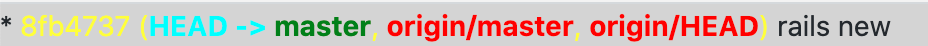

# ansispan

Ruby port of the [JS ansispan library](https://github.com/mmalecki/ansispan), with some enhancements.

## Installation

Add to `Gemfile` and `bundle`
```rb
gem "ansispan"
```

## Usage

```rb
require "ansispan"

ansi_text = "* \e[33m8fb4737\e[m\e[33m (\e[m\e[1;36mHEAD -> \e[m\e[1;32mmaster\e[m\e[33m, \e[m\e[1;31morigin/master\e[m\e[33m, \e[m\e[1;31morigin/HEAD\e[m\e[33m)\e[m rails new\n"
Ansispan.convert(ansi_text)
# => * <span style="color: yellow">8fb4737</span><span style="color: yellow"> (</span><span style="font-weight: bold; color: cyan">HEAD -> </span><span style="font-weight: bold; color: green">master</span><span style="color: yellow">, </span><span style="font-weight: bold; color: red">origin/master</span><span style="color: yellow">, </span><span style="font-weight: bold; color: red">origin/HEAD</span><span style="color: yellow">)</span> rails new
```

---

### Terminal output


### HTML output




#### Ansi color reference

https://gist.github.com/Prakasaka/219fe5695beeb4d6311583e79933a009
(use \033 instead of \e) https://gist.github.com/Prakasaka/219fe5695beeb4d6311583e79933a009#gistcomment-3676483
